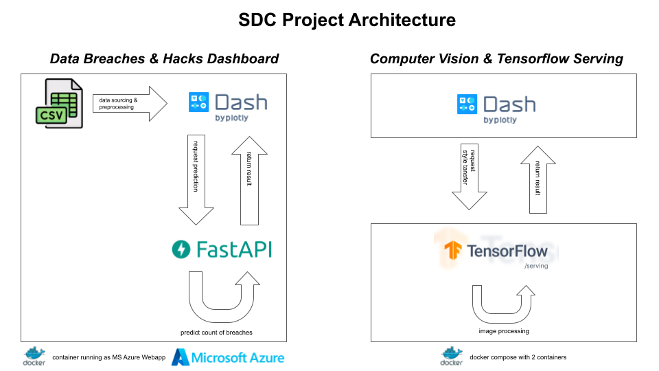

<a name="readme-top"></a>

<!-- PROJECT LOGO -->
<br />
<div align="center">
  <a href="https://github.com/eliasmarcon/Solution_Deployment_Projekt">
    
  </a>

<h3 align="center">Solution Deployment & Communication Project</h3>

  <p align="center">
    Data breaches & hacks dashboard and computer vision with tensorflow serving
    <br />
    <a href="https://sdc-project-cmp.azurewebsites.net">View Demo</a>
    ·
    <a href="https://github.com/eliasmarcon/Solution_Deployment_Projekt/issues">Report Bug</a>
    ·
    <a href="https://github.com/eliasmarcon/Solution_Deployment_Projekt/issues">Request Feature</a>
  </p>
</div>


<!-- TABLE OF CONTENTS -->
<details>
  <summary>Table of Contents</summary>
  <ol>
    <li>
      <a href="#about-the-project">About The Project</a>
      <ul>
        <li><a href="#built-with">Built With</a></li>
      </ul>
    </li>
    <li>
      <a href="#getting-started">Getting Started</a>
      <ul>
        <li><a href="#installation">Installation</a></li>
        <li><a href="#usage">Usage</a></li>
      </ul>
    </li>
    <li><a href="#contact">Contact</a></li>
    <li><a href="#acknowledgments">Acknowledgments</a></li>
  </ol>
</details>


<!-- ABOUT THE PROJECT -->
## About The Project

The aim of the project was to build an MS Azure based dashboard using github actions on the one hand, and a computer vision solution with the help of tensorflow serving on the other. Both parts were setup using docker containers. For an architecture overview - see the image on top.

<p align="right">(<a href="#readme-top">back to top</a>)</p>


### Built With

* Python
* Docker
* Dash
* FastAPI
* MS Azure Webapp
* Tensorflow
* Tensorflow Serving
* Github Action

<p align="right">(<a href="#readme-top">back to top</a>)</p>


<!-- GETTING STARTED -->
## Getting Started

### Installation

There is no installation needed to run the web application as it is already deployed as an webapp to MS Azure. However, if you want to run the code locally, proceed with the following steps:

1. Clone the repo
   ```sh
   git clone https://github.com/eliasmarcon/Solution_Deployment_Projekt.git
   ```
2. Install Python packages
    ```sh
    pip install -r requirements.txt
    ```

<p align="right">(<a href="#readme-top">back to top</a>)</p>


<!-- USAGE EXAMPLES -->
## Usage

* For online usage, visit [https://sdc-project-cmp.azurewebsites.net](https://sdc-project-cmp.azurewebsites.net)


* For local usage, run python script
    ```sh
    python startup.py
    ``` 


<p align="right">(<a href="#readme-top">back to top</a>)</p>


<!-- CONTACT -->
## Contact

* https://github.com/eliasmarcon
* https://github.com/dyn4mic
* https://github.com/loyzious


<p align="right">(<a href="#readme-top">back to top</a>)</p>


<!-- ACKNOWLEDGMENTS -->
## Acknowledgments

* [https://github.com/othneildrew/Best-README-Template](https://github.com/othneildrew/Best-README-Template)


<p align="right">(<a href="#readme-top">back to top</a>)</p>
